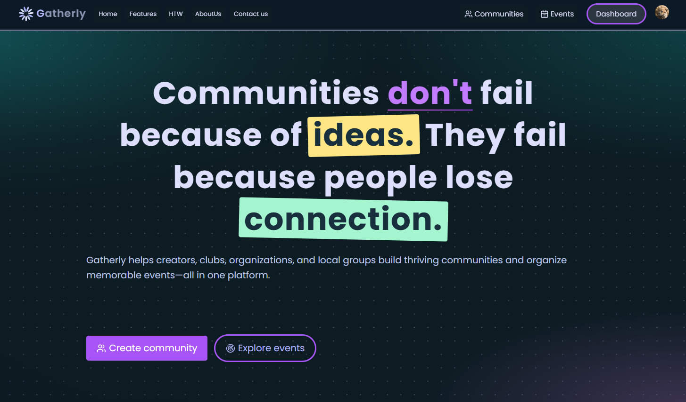
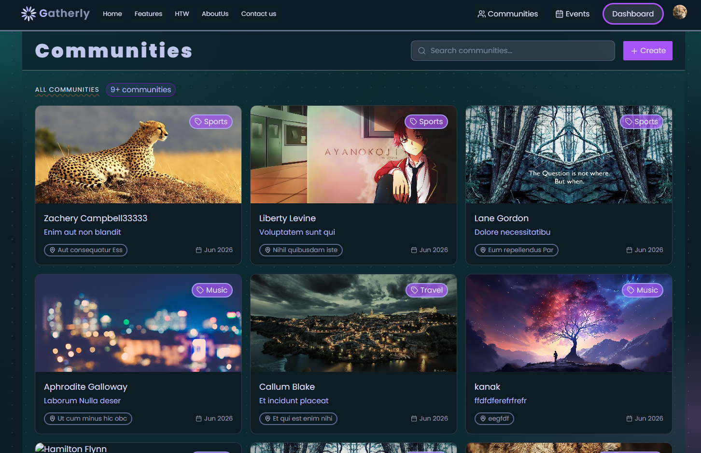
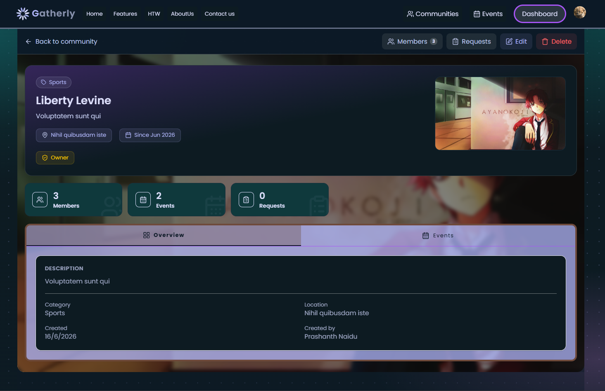
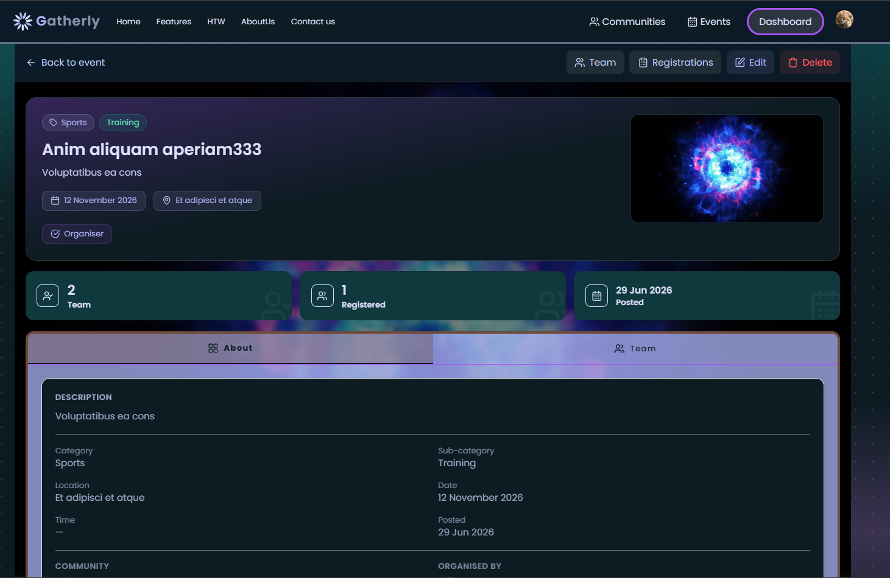
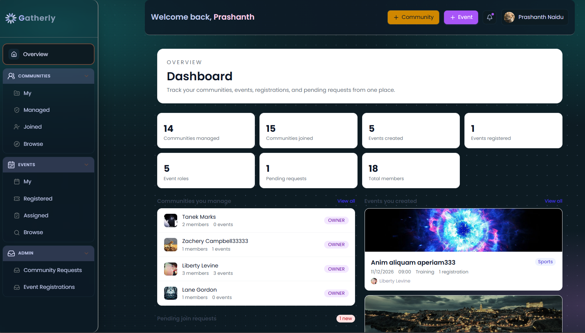

# Gatherly - Community-Event Management Platform

🚧 **Status: In Development** — actively building features, expect frequent changes and breaking updates.

## Preview

| | |
|---|---|
|  |  |
|  |  |
 | | |

 
 

## About

Gatherly helps users create, manage, and discover events while building communities around shared interests.

## Tech Stack

- Frontend: React, TailwindCSS, Tanstack Query
- Backend: Nodejs, Express
- Database: PostgresSQL, Prisma ORM
- Tools: ImageKit

## Status

This project is under active development.